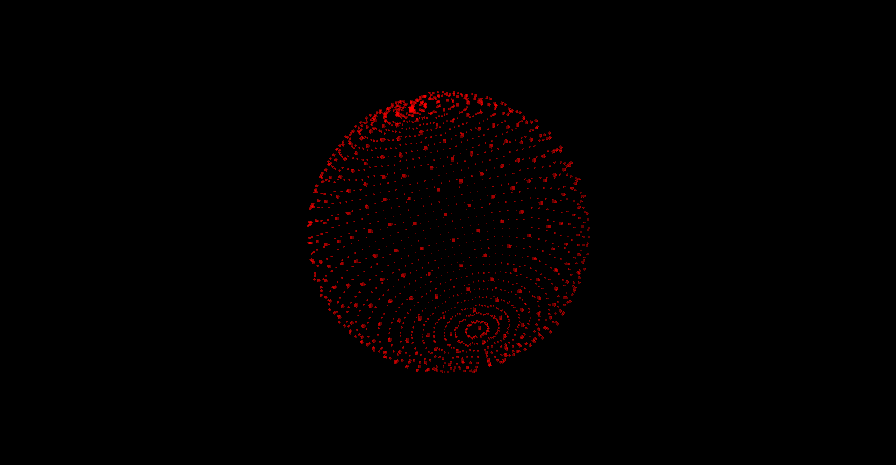

# 3D Shapes

## Script for the 3D Shapes web page, uses under the hood is [Three.js](https://github.com/mrdoob/three.js), a JavaScript library used to create and display animated 3D computer graphics.  

### Installation and use
> You can install the script by cloning/downloading this repository and running Live Server in VS Code. It is also possible to pull the image from the docker hub [ docker pull alekstar79/3d-shapes ] and run [ docker run -d -p 80:80 --rm --name 3d-shapes alekstar79/3d-shapes ]. For ease of use, a Makefile has been created with short commands [ pull, run, stop ]. Or just open the index file [ index.html ] in any browser.

